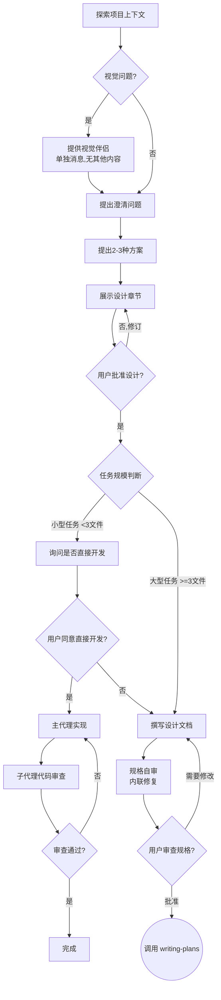

# 将创意头脑风暴为设计

通过自然的协作对话，帮助将创意转化为完整的设计和规格说明。

首先从理解当前项目上下文开始，然后逐一提出问题来完善创意。一旦理解了要构建的内容，就展示设计方案并获取用户批准。

<HARD-GATE>
在展示设计方案并获得用户批准之前，不要调用任何实现技能、编写任何代码、搭建任何项目框架或采取任何实现行动。这适用于每个项目，无论其看起来多么简单。
</HARD-GATE>

## 反模式："这太简单了，不需要设计"

每个项目都要经历这个过程。待办事项列表、单功能工具、配置变更——所有这些都不例外。"简单"的项目恰恰是那些未经检验的假设造成最大浪费的地方。设计文档可以很简短（对于真正简单的项目只需几句话），但你必须展示它并获得批准。

## 检查清单

你必须为以下每一项创建任务，并按顺序完成：

1. **探索项目上下文** — 检查文件、文档、最近的提交记录
2. **提供视觉辅助**（如果话题涉及视觉问题）—— 这是一条独立的消息，不要与澄清问题合并。参见下方的视觉辅助部分。
3. **提出澄清问题** — 一次一个，理解目的/约束/成功标准
4. **提出 2-3 种方案** — 包含权衡取舍和你的建议
5. **展示设计** — 按复杂度分段展示，每段之后获取用户批准
6. **任务规模判断** — 根据预估的创建/修改文件数量决定后续流程（见下文）
7. **编写设计文档**（大型任务）— 保存到 `docs/specs/active/YYYY-MM-DD-<topic>-design.md` 并提交
8. **规格自检**（大型任务）— 快速内联检查占位符、矛盾、歧义、范围（见下文）
9. **用户审阅书面规格**（大型任务）— 在继续之前请用户审阅规格文件
10. **过渡到实现** — 调用 writing-plans 技能来创建实施计划（大型任务）或直接进入开发（小型任务）

## 流程图

**终态是调用 writing-plans。** 不要调用 frontend-design、mcp-builder 或任何其他实现技能。头脑风暴之后唯一调用的技能是 writing-plans。

## 任务规模判断

在展示设计并获得用户批准后，根据预估的创建/修改文件数量决定后续流程：

**小型任务（预估 < 3 个文件）：**
- 跳过规格文档和计划文档的创建
- 直接询问用户是否开始开发
- 使用主代理开发 + 子代理审查模式
- 流程：设计 → 用户批准 → 询问是否直接开发 → 主代理实现 → 子代理代码审查 → 完成

**大型任务（预估 >= 3 个文件）：**
- 创建规格文档和计划文档
- 使用完整的 subagent-driven-development 或 executing-plans 流程
- 流程：设计 → 用户批准 → 规格文档 → 计划文档 → 子代理开发 → 完成

**判断方法：**
- 在展示设计时，估算需要创建的新文件和修改的现有文件数量
- 向用户展示估算结果并确认任务规模
- 如果用户明确要求创建规格/计划文档，即使文件数量少也应遵循

## 流程

**理解创意：**

- 首先了解当前项目状态（文件、文档、最近的提交记录）
- 在提出详细问题之前，先评估范围：如果请求描述了多个独立的子系统（例如，"构建一个包含聊天、文件存储、计费和分析的平台"），立即标记出来。不要在一个需要先分解的项目上花费问题去完善细节。
- 如果项目太大而无法用单一规格说明，帮助用户将其分解为子项目：哪些是独立的模块，它们如何关联，应该按什么顺序构建？然后通过正常的设计流程对第一个子项目进行头脑风暴。每个子项目都有自己的规格说明 → 计划 → 实现周期。
- 对于范围合适的项目，逐一提出问题来完善创意
- 尽可能使用选择题，但开放式问题也可以
- 每条消息只提一个问题——如果某个话题需要更多探索，将其拆分为多个问题
- 重点理解：目的、约束、成功标准

**探索方案：**

- 提出 2-3 种不同的方案，包含权衡取舍
- 以对话方式展示选项，附上你的建议和理由
- 首先提出你推荐的选项并解释原因

**展示设计：**

- 一旦你认为理解了要构建的内容，就展示设计
- 根据复杂度调整每个部分的篇幅：如果简单明了只需几句话，如果复杂微妙则可达 200-300 字
- 在每个部分之后询问到目前为止是否看起来正确
- 涵盖：架构、组件、数据流、错误处理、测试
- 如果某些内容不合理，准备好返回并澄清

**为隔离性和清晰性而设计：**

- 将系统拆分为更小的单元，每个单元都有一个明确的目的，通过定义良好的接口进行通信，并且可以独立理解和测试
- 对于每个单元，你应该能够回答：它做什么、如何使用它、它依赖什么？
- 有人能否在不阅读其内部的情况下理解一个单元的作用？你能否在不破坏调用方的情况下更改其内部？如果不能，边界需要调整。
- 更小、边界清晰的单元也更容易处理——你能更好地推理那些可以同时在脑海中把握的代码，而且当文件聚焦时，你的编辑也更可靠。当一个文件变得很大时，这通常是它在承担过多职责的信号。

**在现有代码库中工作：**

- 在提出变更之前先探索当前结构。遵循现有模式。
- 如果现有代码存在影响工作的问题（例如，文件变得过大、边界不清晰、职责纠缠），将针对性的改进作为设计的一部分——就像优秀的开发者在工作中改进代码一样。
- 不要提出不相关的重构。专注于服务于当前目标的内容。

## 设计完成后

**文档：**

- 将经过验证的设计（规格说明）写入 `docs/specs/active/YYYY-MM-DD-<topic>-design.md`
- 在整个工作项完成之前，将规格说明保留在 `docs/specs/active/` 中，然后将其移动到 `docs/specs/completed/`
  - （用户对规格说明位置的偏好会覆盖此默认值）
- 规格说明文档默认使用中文，包括标题、各级标题、正文、列表和固定提示语言。
- 如果用户明确要求规格说明使用英文或其他语言，请遵循用户的指令而非默认值。
- 除非用户明确要求，否则不要翻译代码块、shell 命令、文件路径、技能名称或标识符。
- 如果可用，使用 elements-of-style:writing-clearly-and-concisely 技能
- **不要自动提交设计文档** — 等待用户明确要求后再提交

**规格自检：**
编写完规格说明文档后，用全新的眼光审视它：

1. **占位符扫描：** 是否存在 "TBD"、"TODO"、不完整的部分或模糊的需求？修复它们。
2. **内部一致性：** 各部分之间是否存在矛盾？架构是否与功能描述匹配？
3. **范围检查：** 这是否足够聚焦以作为单一实施计划，还是需要进一步分解？
4. **歧义检查：** 是否有任何需求可以用两种不同的方式解读？如果是，选择一种并明确说明。

内联修复任何问题。无需重新审阅——只需修复并继续。

**用户审阅关卡：**
在规格审阅循环通过后，在继续之前请用户审阅书面规格说明：

> "Spec 已写入并提交到 `<path>`。请先审阅；如果你希望调整，请在开始编写实施计划之前告诉我。"

等待用户的回复。如果他们要求修改，进行修改并重新运行规格审阅循环。只有在用户批准后才能继续。

**小型任务处理：**
如果任务规模判断为小型任务（< 3 个文件），跳过规格文档创建，直接询问用户：

> "根据设计，这个任务预计涉及 < N 个文件。我们可以跳过规格文档和计划文档，直接开始开发。是否现在开始？"

如果用户同意，使用主代理开发 + 子代理审查模式。详细流程请参阅：`./small-task-development.md`

如果用户不同意：
- 按大型任务流程创建规格文档和计划文档

**实现：**

- 对于大型任务：调用 writing-plans 技能来创建详细的实施计划
- 对于小型任务：直接进入开发阶段，使用主代理实现 + 子代理审查模式
- 不要调用任何其他技能。writing-plans 是大型任务的下一步。

## 核心原则

- **一次一个问题** — 不要用多个问题压垮用户
- **优先选择题** — 尽可能比开放式问题更容易回答
- **严格执行 YAGNI** — 从所有设计中移除不必要的功能
- **探索替代方案** — 在确定之前始终提出 2-3 种方案
- **增量验证** — 展示设计，在继续之前获得批准
- **保持灵活** — 当某些内容不合理时，返回并澄清

## 视觉辅助

一个基于浏览器的辅助工具，用于在头脑风暴期间展示原型、图表和视觉选项。作为工具提供——而非模式。接受该辅助工具意味着它可用于那些能从视觉处理中受益的问题；但这并不意味着每个问题都要通过浏览器。

**提供辅助工具：** 当你预期接下来的问题将涉及视觉内容（原型、布局、图表）时，一次性征求同意：
> "Some of what we're working on might be easier to explain if I can show it to you in a web browser. I can put together mockups, diagrams, comparisons, and other visuals as we go. This feature is still new and can be token-intensive. Want to try it? (Requires opening a local URL)"

**此提议必须是独立的消息。** 不要将其与澄清问题、上下文摘要或任何其他内容合并。该消息应仅包含上述提议，别无其他。在继续之前等待用户的回复。如果他们拒绝，则仅使用文本进行头脑风暴。

**逐问题决策：** 即使用户接受后，也要为每个问题决定是使用浏览器还是终端。判断标准是：**用户通过观看会比阅读更好地理解它吗？**

- **使用浏览器**处理视觉内容——原型、线框图、布局对比、架构图、并排的视觉设计
- **使用终端**处理文本内容——需求问题、概念选择、权衡列表、A/B/C/D 文本选项、范围决策

关于 UI 主题的问题不一定是视觉问题。"在这个上下文中，personality 是什么意思？"是一个概念性问题——使用终端。"哪种向导布局更好？"是一个视觉问题——使用浏览器。

如果他们同意使用辅助工具，在继续之前请阅读详细指南：
`./visual-companion.md`
