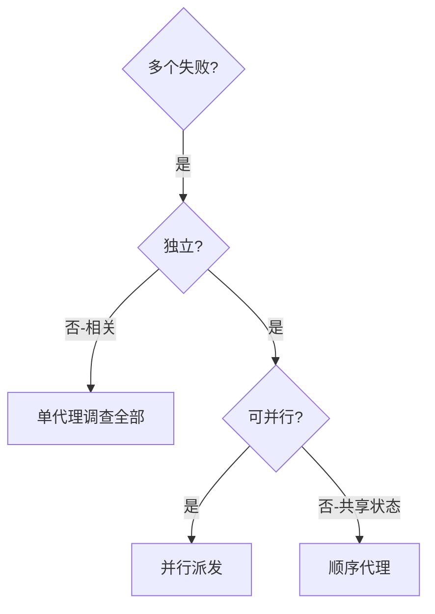

# 并行派发代理（Dispatching Parallel Agents）

## 概述

你将任务委派给具有隔离上下文的专业代理。通过精确构建它们的指令和上下文，你确保它们保持专注并成功完成任务。它们绝不应继承你会话的上下文或历史 —— 你构建它们所需的精确内容。这也为你保留了用于协调工作的上下文。

当你有多个不相关的失败（不同的测试文件、不同的子系统、不同的 bug）时，按顺序调查它们会浪费时间。每个调查都是独立的，可以并行进行。

**核心原则：** 每个独立问题域派发一个代理。让它们并发工作。

## 何时使用



**使用场景：**
- 3+ 测试文件因不同根因失败
- 多个子系统独立损坏
- 每个问题无需其他上下文即可单独理解
- 调查之间不存在共享状态

**不使用场景：**
- 失败是相关的（修复一个可能修复其他）
- 需要理解完整的系统状态
- 代理会互相干扰

## 模式

### 1. 识别独立域

按损坏的内容对失败进行分组：
- 文件 A 测试：工具审批流程
- 文件 B 测试：批量完成行为
- 文件 C 测试：中止功能

每个域都是独立的 —— 修复工具审批不会影响中止测试。

### 2. 创建聚焦的代理任务

每个代理获得：
- **特定范围：** 一个测试文件或子系统
- **明确目标：** 让这些测试通过
- **约束：** 不要更改其他代码
- **预期输出：** 总结你发现和修复的内容

### 3. 并行派发

```typescript
// In OpenCode
task({
  description: "Review agent-tool-abort failures",
  subagent_type: "general",
  prompt: "Fix src/agents/agent-tool-abort.test.ts failures and return a summary."
})
task({
  description: "Review batch-completion failures",
  subagent_type: "general",
  prompt: "Fix src/agents/batch-completion-behavior.test.ts failures and return a summary."
})
task({
  description: "Review tool-approval failures",
  subagent_type: "general",
  prompt: "Fix src/agents/tool-approval-race-conditions.test.ts failures and return a summary."
})
// Dispatch all three in parallel
```

### 4. 审查与集成

当代理返回时：
- 阅读每个总结
- 验证修复是否冲突
- 运行完整测试套件
- 集成所有更改

## 代理提示结构

优秀的代理提示具有以下特点：
1. **聚焦** —— 一个清晰的问题域
2. **自包含** —— 理解问题所需的所有上下文
3. **输出具体** —— 代理应该返回什么？

```markdown
Fix the 3 failing tests in src/agents/agent-tool-abort.test.ts:

1. "should abort tool with partial output capture" - expects 'interrupted at' in message
2. "should handle mixed completed and aborted tools" - fast tool aborted instead of completed
3. "should properly track pendingToolCount" - expects 3 results but gets 0

These are timing/race condition issues. Your task:

1. Read the test file and understand what each test verifies
2. Identify root cause - timing issues or actual bugs?
3. Fix by:
   - Replacing arbitrary timeouts with event-based waiting
   - Fixing bugs in abort implementation if found
   - Adjusting test expectations if testing changed behavior

Do NOT just increase timeouts - find the real issue.

Return: Summary of what you found and what you fixed.
```

## 常见错误

**❌ 范围太广：** "修复所有测试" —— 代理会迷失方向
**✅ 具体：** "修复 agent-tool-abort.test.ts" —— 聚焦范围

**❌ 没有上下文：** "修复竞态条件" —— 代理不知道在哪里
**✅ 有上下文：** 粘贴错误消息和测试名称

**❌ 没有约束：** 代理可能会重构所有内容
**✅ 有约束：** "不要更改生产代码" 或 "仅修复测试"

**❌ 输出模糊：** "修复它" —— 你不知道更改了什么
**✅ 具体：** "返回根因和更改的总结"

## 何时不使用

**相关失败：** 修复一个可能修复其他 —— 先一起调查
**需要完整上下文：** 理解需要看到整个系统
**探索性调试：** 你还不知道什么坏了
**共享状态：** 代理会互相干扰（编辑相同文件、使用相同资源）

## 会话中的真实示例

**场景：** 重大重构后 3 个文件中的 6 个测试失败

**失败：**
- agent-tool-abort.test.ts：3 个失败（时序问题）
- batch-completion-behavior.test.ts：2 个失败（工具未执行）
- tool-approval-race-conditions.test.ts：1 个失败（执行次数 = 0）

**决策：** 独立域 —— 中止逻辑与批量完成和竞态条件分离

**派发：**
```
Agent 1 → Fix agent-tool-abort.test.ts
Agent 2 → Fix batch-completion-behavior.test.ts
Agent 3 → Fix tool-approval-race-conditions.test.ts
```

**结果：**
- Agent 1：将超时替换为基于事件的等待
- Agent 2：修复了事件结构 bug（threadId 位置错误）
- Agent 3：添加了等待异步工具执行完成

**集成：** 所有修复独立，无冲突，完整套件通过

**节省时间：** 3 个问题并行解决，而非按顺序

## 主要优势

1. **并行化** —— 多个调查同时进行
2. **聚焦** —— 每个代理范围狭窄，需要跟踪的上下文更少
3. **独立性** —— 代理互不干扰
4. **速度** —— 用 1 个问题的时间解决 3 个问题

## 验证

代理返回后：
1. **审查每个总结** —— 了解更改了什么
2. **检查冲突** —— 代理是否编辑了相同的代码？
3. **运行完整套件** —— 验证所有修复能否协同工作
4. **抽查** —— 代理可能会犯系统性错误

## 实际影响

来自调试会话（2025-10-03）：
- 3 个文件中的 6 个失败
- 3 个代理并行派发
- 所有调查并发完成
- 所有修复成功集成
- 代理更改之间零冲突
