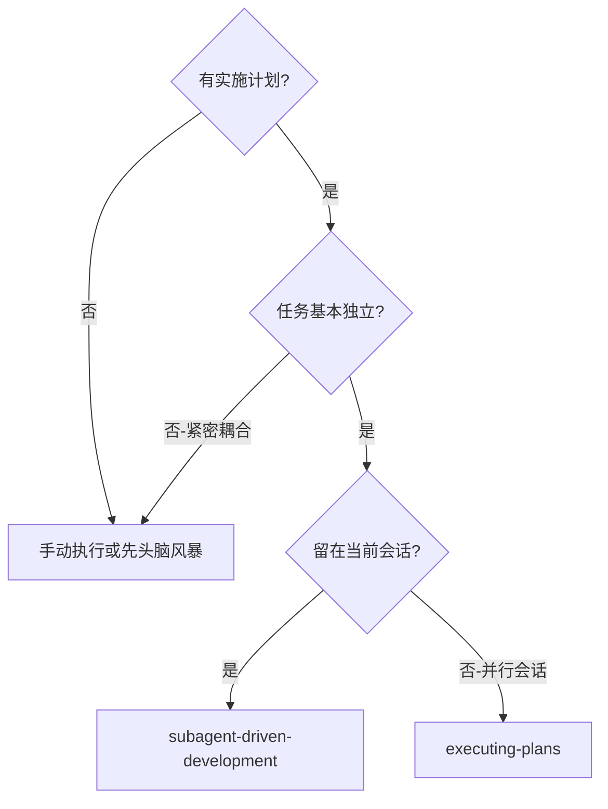
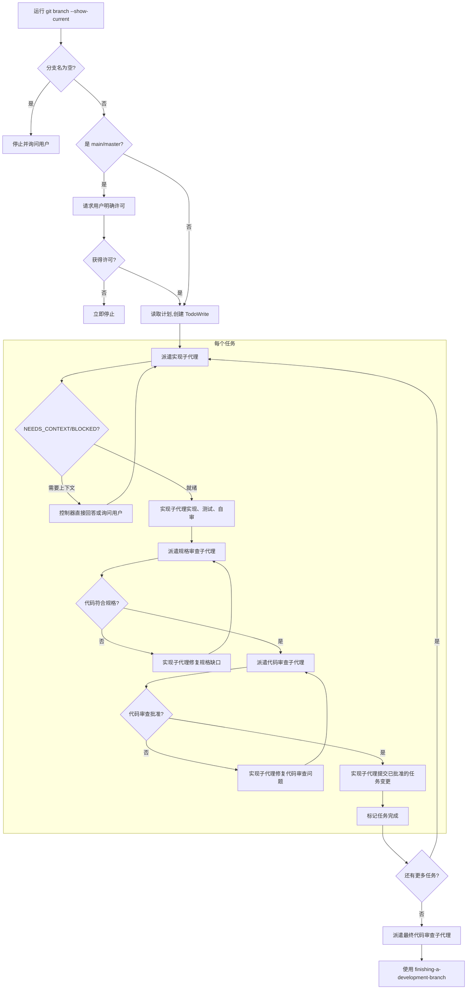

# 子代理驱动开发

在每个任务边界派遣一个全新的子代理来执行计划，每个任务之后进行两阶段审查：先进行规格合规审查，然后进行代码审查。只有两个审查都通过后，才提交任务。

**为什么使用子代理：** 你将任务委派给具有隔离上下文的专门代理。通过精确设计它们的指令和上下文，你确保它们保持专注并成功完成任务。它们绝不应继承你的会话上下文或历史——你准确地构建它们所需的内容。这也为你自己的协调工作保留了上下文。

**核心原则：** 每个任务边界使用全新子代理 + 两阶段审查（先规格后代码审查）+ 仅在批准后才提交 = 高质量、快速迭代

角色行为定义在 `agents/*.md` 中，而完整的任务特定上下文位于本技能的 `*-dispatch-prompt.md` 模板中。

## 何时使用



**与 executing-plans（并行会话）的对比：**
- 同一会话（无需切换上下文）
- 每个任务使用全新子代理（无上下文污染）
- 每个任务后进行两阶段审查：先规格合规，后代码审查
- 更快的迭代速度（任务之间无需人工介入）

## 派遣前的分支检查

在读取任务或派遣任何实现子代理之前：

1. 运行 `git branch --show-current`
2. 如果分支名称为空，停止并询问用户如何继续
3. 如果分支是 `main` 或 `master`，在实施前请求用户明确许可
4. 如果用户不批准在 `main/master` 上直接开发，立即停止
5. 否则继续正常流程

## 流程



每个任务的提交仅在规格合规审查和代码审查都批准该任务后才进行。审查者将任务未提交的差异与任务的基础提交进行比较；控制器在审查循环通过后才告诉实现者进行提交。

## 模型选择

使用能够胜任每个角色的最低能力模型，以节省成本并提高速度。

**机械实现任务**（独立函数、明确的规格、1-2 个文件）：使用快速、廉价的模型。当计划定义明确时，大多数实现任务都是机械性的。

**集成和判断任务**（多文件协调、模式匹配、调试）：使用标准模型。

**架构、设计和审查任务**：使用可用的最强模型。

**任务复杂度信号：**
- 触及 1-2 个文件且有完整规格 -> 廉价模型
- 触及多个文件且有集成问题 -> 标准模型
- 需要设计判断或对代码库的广泛理解 -> 最强模型

## 任务边界隔离（关键）

上下文隔离是这个工作流的全部意义所在。将每个计划任务视为一个硬边界。

**必须遵守的规则：**
- **不同的计划任务 => 不同的子代理会话。** 启动新的 `task` 调用，不要传递之前的 `task_id`。
- **绝不要复用之前任务的 `task_id` 值**，无论是实现者、规格审查者还是代码审查者。
- **仅在同一个计划任务内允许复用**（用于 `NEEDS_CONTEXT`、重新派遣和审查/修复循环）。
- 一旦计划任务被标记为完成，视为该任务的所有子代理会话 ID 已关闭且不可用。

**派遣前控制器的合理性检查：**
- 如果当前任务标签发生变化（例如从任务 1 变为任务 2），任何尝试恢复先前 `task_id` 的行为都是对工作流的违反。

## 处理实现者状态

实现者子代理报告四种状态之一。分别适当处理：

**DONE（完成）：** 进入规格合规审查。

**DONE_WITH_CONCERNS（完成但有顾虑）：** 实现者已完成工作但标记了疑虑。在继续之前阅读这些顾虑。如果顾虑涉及正确性或范围，在审查前解决它们。如果只是观察意见（例如"这个文件越来越大了"），记录它们并继续审查。

**NEEDS_CONTEXT（需要上下文）：** 实现者需要未提供的信息。直接提供缺失的上下文，或者如果需要人工输入则使用 OpenCode `question` 工具，然后重新派遣。

**BLOCKED（受阻）：** 实现者无法完成任务。评估阻碍原因：
1. 如果是上下文问题，提供更多上下文并使用相同模型重新派遣
2. 如果任务需要更多推理，使用更强的模型重新派遣
3. 如果任务太大，将其拆分为更小的部分
4. 如果计划本身有误，上报给人类

**绝不要**忽略上报或在不做改变的情况下强制相同模型重试。如果实现者表示卡住了，说明需要做出改变。

## 提示模板

- `./implementer-dispatch-prompt.md` - 派遣真正的 `implementer` 子代理，附带完整任务详情
- `./spec-reviewer-dispatch-prompt.md` - 派遣真正的 `spec-reviewer` 子代理，附带完整需求上下文
- `./code-reviewer-dispatch-prompt.md` - 派遣真正的 `code-reviewer` 子代理，针对当前任务差异进行审查

## 示例工作流

```
You: I'm using Subagent-Driven Development to execute this plan.

[Read plan file once: docs/plans/active/feature-plan.md]
[Extract all 5 tasks with full text and context]
[Create TodoWrite with all tasks]

Task 1: Hook installation script

[Get Task 1 line range from plan file: lines 15-45]
[Dispatch implementation subagent with:
  - spec_doc_path: docs/specs/active/feature-design.md (if exists)
  - task_scope: Task 1 requirements from spec
  - plan_file: docs/plans/active/feature-plan.md
  - plan_line_range: 15-45
  - repo_path: /path/to/repo
]

Implementer: [Reads plan file lines 15-45, implements task]
Implementer: `Status: NEEDS_CONTEXT` - should the hook be installed at user or system level?

You: [Use OpenCode `question` if needed, or answer directly]

[Re-dispatch implementer with clarified context]
[Later] Implementer:
  - Implemented install-hook command
  - Added tests, 5/5 passing
  - Self-review: Found I missed --force flag, added it

[Dispatch spec compliance reviewer with:
  - spec_doc_path: docs/specs/active/feature-design.md
  - task_scope: Task 1 requirements
  - plan_file: docs/plans/active/feature-plan.md
  - plan_line_range: 15-45
  - diff_base: BASE_SHA
]

Spec reviewer: ✅ Spec compliant - all requirements met, nothing extra

[Dispatch code reviewer against Task 1 base commit + current working tree diff]
Code reviewer: Strengths: Good test coverage, clean. Issues: None. Approved.

[Implementer commits approved task changes]
[Mark Task 1 complete]

Task 2: Recovery modes

[Get Task 2 line range from plan file: lines 47-92]
[Create NEW implementer subagent session for Task 2 (do not reuse Task 1 `task_id`)]
[Dispatch implementation subagent with:
  - spec_doc_path: docs/specs/active/feature-design.md
  - task_scope: Task 2 requirements from spec
  - plan_file: docs/plans/active/feature-plan.md
  - plan_line_range: 47-92
  - repo_path: /path/to/repo
]

Implementer: [No extra context needed, proceeds]
Implementer:
  - Added verify/repair modes
  - 8/8 tests passing
  - Self-review: All good

[Dispatch spec compliance reviewer]
Spec reviewer: ❌ Issues:
  - Missing: Progress reporting (spec says "report every 100 items")
  - Extra: Added --json flag (not requested)

[Implementer fixes issues]
Implementer: Removed --json flag, added progress reporting

[Spec reviewer reviews again]
Spec reviewer: ✅ Spec compliant now

[Dispatch code reviewer against Task 2 base commit + current working tree diff]
Code reviewer: Strengths: Solid. Issues (Important): Magic number (100)

[Implementer fixes]
Implementer: Extracted PROGRESS_INTERVAL constant

[Code reviewer reviews again]
Code reviewer: ✅ Approved

[Implementer commits approved task changes]
[Mark Task 2 complete]

...

[After all tasks]
[Dispatch final reviewer subagent]
Final reviewer: All requirements met, ready to merge

Done!
```

## 优势

**与手动执行的对比：**
- 子代理自然遵循 TDD
- 每个任务有全新上下文（不会混淆）
- 并行安全（子代理不会互相干扰）
- 子代理可以在工作前或工作中提出 `NEEDS_CONTEXT`，控制器可以在需要用户输入时使用 `question`

**与 executing-plans 的对比：**
- 同一会话（无需交接）
- 持续进展（无需等待）
- 审查检查点自动进行

**效率提升：**
- 无文件读取开销（控制器提供完整文本）
- 控制器精确策划所需的上下文
- 子代理预先获得完整信息
- 问题在工作开始前就暴露出来（而不是之后）

**新的上下文传递方式：**
- 只传递规格文档路径、任务范围和计划文档行号范围
- 子代理自行读取计划文档获取详细信息
- 减少控制器的准备工作
- 子代理可以按需获取完整上下文
- 保持上下文隔离的同时提供必要的导航信息

**质量关卡：**
- 自检在交接前发现问题
- 两阶段审查：规格合规，然后代码审查
- 审查循环确保修复真正有效
- 规格合规防止过度/不足开发
- 代码质量确保实现构建良好

**成本：**
- 更多的子代理调用（每个任务需要实现者 + 2 个审查者）
- 控制器需要做更多准备工作（预先提取所有任务）
- 审查循环增加迭代次数
- 但能及早发现问题（比后期调试更便宜）

## 危险信号

**绝不要：**
- 未经用户明确同意就在 main/master 分支上开始实施
- 跳过审查（规格合规或代码审查）
- 带着未修复的问题继续
- 并行派遣多个实现子代理（会产生冲突）
- 让子代理读取计划文件（应提供完整文本）
- 跳过场景设置上下文（子代理需要理解任务的位置）
- 忽略 `NEEDS_CONTEXT` 或 `BLOCKED` 响应（在重新派遣前解决它们）
- 在规格合规上接受"差不多就行"（规格审查者发现问题 = 未完成）
- 跳过审查循环（审查者发现问题 = 实现者修复 = 再次审查）
- 让实现者的自检取代实际审查（两者都需要）
- **在规格合规通过 ✅ 之前开始代码审查**（顺序错误）
- **在规格合规和代码审查都通过 ✅ 之前提交任务更改**
- 在任一审查还有未解决问题时进入下一个任务
- 在派遣任务 N+1 时复用任务 N 的任何 `task_id`（上下文污染）

**如果子代理返回 `NEEDS_CONTEXT`：**
- 清晰且完整地回答
- 提供额外上下文或使用 `question` 询问用户
- 使用澄清后的上下文重新派遣
- 不要催促它们进入实现阶段

**如果审查者发现问题：**
- 实现者（同任务子代理）修复它们
- 审查者再次审查
- 重复直到获得批准
- 仅在两个审查阶段都批准后才提交
- 不要跳过重新审查

**如果子代理任务失败：**
- 派遣修复子代理，附带具体指令
- 不要尝试手动修复（上下文污染）

## 集成

**必需的工作流技能：**
- **`writing-plans`** - 创建本技能执行的计划
- **`finishing-a-development-branch`** - 在所有任务完成后完成开发

**子代理应使用：**
- **`test-driven-development`** - 子代理为每个任务遵循 TDD

**替代工作流：**
- **`executing-plans`** - 用于并行会话而非同一会话执行
