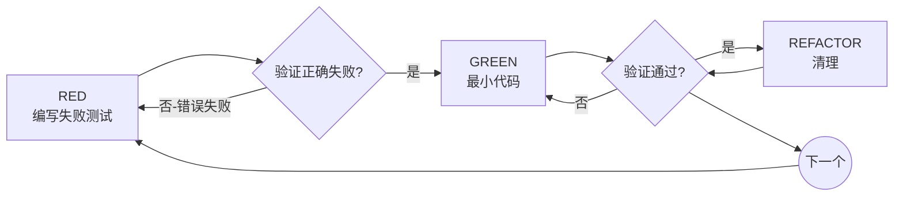

# 测试驱动开发（TDD）

## 概述

先写测试。看着它失败。编写最小代码使其通过。

**核心原则：** 如果你没有看着测试失败，你就不知道它是否在测试正确的东西。

**违反规则的字面意思就是在违反规则的精神。**

## 何时使用

**始终适用：**
- 新功能
- Bug 修复
- 重构
- 行为变更

**例外情况（询问你的合作伙伴）：**
- 一次性原型
- 生成的代码
- 配置文件

觉得"这次就跳过 TDD 吧"？停。那是自我合理化。

## 铁律

```
NO PRODUCTION CODE WITHOUT A FAILING TEST FIRST
```

在测试之前写了代码？删掉它。重新开始。

**没有例外：**
- 不要保留它作为"参考"
- 不要在写测试时"适配"它
- 不要看它
- 删除就是删除

从测试出发重新实现。就这样。

## 红-绿-重构



### RED - 编写失败测试

编写一个最小化的测试，展示应该发生什么。

<Good>
```typescript
test('retries failed operations 3 times', async () => {
  let attempts = 0;
  const operation = () => {
    attempts++;
    if (attempts < 3) throw new Error('fail');
    return 'success';
  };

  const result = await retryOperation(operation);

  expect(result).toBe('success');
  expect(attempts).toBe(3);
});
```
名称清晰，测试真实行为，只测一件事
</Good>

<Bad>
```typescript
test('retry works', async () => {
  const mock = jest.fn()
    .mockRejectedValueOnce(new Error())
    .mockRejectedValueOnce(new Error())
    .mockResolvedValueOnce('success');
  await retryOperation(mock);
  expect(mock).toHaveBeenCalledTimes(3);
});
```
名称模糊，测试的是 mock 而不是代码
</Bad>

**要求：**
- 一个行为
- 清晰的名称
- 真实代码（除非不可避免，否则不使用 mock）

### Verify RED - 看着它失败

**强制要求。绝不可跳过。**

```bash
npm test path/to/test.test.ts
```

确认：
- 测试失败（不是报错）
- 失败消息是预期的
- 失败是因为功能缺失（不是拼写错误）

**测试通过了？** 你在测试已有行为。修复测试。

**测试报错了？** 修复错误，重新运行直到正确失败。

### GREEN - 最小代码

编写最简单的代码来通过测试。

<Good>
```typescript
async function retryOperation<T>(fn: () => Promise<T>): Promise<T> {
  for (let i = 0; i < 3; i++) {
    try {
      return await fn();
    } catch (e) {
      if (i === 2) throw e;
    }
  }
  throw new Error('unreachable');
}
```
刚好够通过
</Good>

<Bad>
```typescript
async function retryOperation<T>(
  fn: () => Promise<T>,
  options?: {
    maxRetries?: number;
    backoff?: 'linear' | 'exponential';
    onRetry?: (attempt: number) => void;
  }
): Promise<T> {
  // YAGNI
}
```
过度设计
</Bad>

不要添加功能，不要重构其他代码，不要超出测试范围"改进"。

### Verify GREEN - 看着它通过

**强制要求。**

```bash
npm test path/to/test.test.ts
```

确认：
- 测试通过
- 其他测试仍然通过
- 输出干净（无错误、无警告）

**测试失败了？** 修复代码，不是测试。

**其他测试失败了？** 立即修复。

### REFACTOR - 清理

仅在绿灯之后：
- 消除重复
- 改善命名
- 提取辅助函数

保持测试绿灯。不要添加行为。

### 重复

下一个失败测试对应下一个功能。

## 好的测试

| 质量 | 好的 | 坏的 |
|---------|------|-----|
| **最小化** | 一件事。名称里有"and"？拆分它。 | `test('validates email and domain and whitespace')` |
| **清晰** | 名称描述行为 | `test('test1')` |
| **表达意图** | 展示期望的 API | 掩盖代码应该做什么 |

## 为什么顺序很重要

**"我之后写测试来验证它是否工作"**

事后写的测试立即通过。立即通过什么也证明不了：
- 可能测试了错误的东西
- 可能测试了实现，而不是行为
- 可能遗漏了你忘记的边界情况
- 你从未看到它捕获 bug

测试优先迫使你看到测试失败，证明它确实在测试某些东西。

**"我已经手动测试了所有边界情况"**

手动测试是临时的。你以为你测试了一切，但是：
- 没有测试记录
- 代码更改时无法重新运行
- 压力下容易忘记情况
- "我试的时候它能工作" ≠ 全面

自动化测试是系统性的。每次运行方式都相同。

**"删除 X 小时的工作是浪费"**

沉没成本谬误。时间已经过去了。你现在的选择：
- 删除并用 TDD 重写（再花 X 小时，高信心）
- 保留它并事后加测试（30 分钟，低信心，可能有 bug）

"浪费"的是保留你无法信任的代码。没有真实测试的能工作的代码就是技术债务。

**"TDD 是教条主义，务实意味着灵活适应"**

TDD 就是务实的：
- 在提交前发现 bug（比事后调试更快）
- 防止回归（测试立即捕获破坏）
- 记录行为（测试展示如何使用代码）
- 支持重构（自由修改，测试捕获破坏）

"务实"的捷径 = 在生产环境中调试 = 更慢。

**"事后测试也能达到同样目标——这是精神不是仪式"**

不。事后测试回答"这段代码做什么？"测试优先回答"这段代码应该做什么？"

事后测试受你的实现影响。你测试的是你构建的，而不是所需的。你验证的是记住的边界情况，而不是发现的。

测试优先在实现之前强制发现边界情况。事后测试验证你是否记住了所有东西（你没记住）。

事后测试 30 分钟 ≠ TDD。你得到了覆盖率，但失去了测试有效性的证明。

## 常见的自我合理化

| 借口 | 现实 |
|--------|---------|
| "太简单了，不用测试" | 简单代码也会出问题。测试只需 30 秒。 |
| "我之后再测试" | 测试立即通过什么也证明不了。 |
| "事后测试也能达到同样目标" | 事后测试 = "这段代码做什么？" 测试优先 = "这段代码应该做什么？" |
| "我已经手动测试过了" | 临时 ≠ 系统。没有记录，无法重新运行。 |
| "删除 X 小时是浪费" | 沉没成本谬误。保留未验证的代码就是技术债务。 |
| "保留作为参考，先写测试" | 你会适配它。那就是事后测试。删除就是删除。 |
| "需要先探索一下" | 可以。丢弃探索，用 TDD 重新开始。 |
| "测试很难 = 设计不清晰" | 倾听测试。难以测试 = 难以使用。 |
| "TDD 会拖慢我" | TDD 比调试更快。务实 = 测试优先。 |
| "手动测试更快" | 手动测试无法证明边界情况。每次更改你都得重新测试。 |
| "现有代码没有测试" | 你正在改进它。为现有代码添加测试。 |

## 危险信号 - 停下来重新开始

- 代码在测试之前
- 实现之后写测试
- 测试立即通过
- 无法解释为什么测试失败
- "稍后"添加测试
- 合理化"就这一次"
- "我已经手动测试过了"
- "事后测试能达到同样目的"
- "这是关于精神不是仪式"
- "保留作为参考"或"适配现有代码"
- "已经花了 X 小时，删除是浪费"
- "TDD 是教条主义，我在务实"
- "这次不一样因为..."

**所有这些意味着：删除代码。用 TDD 重新开始。**

## 示例：Bug 修复

**Bug：** 接受空邮箱

**RED**
```typescript
test('rejects empty email', async () => {
  const result = await submitForm({ email: '' });
  expect(result.error).toBe('Email required');
});
```

**Verify RED**
```bash
$ npm test
FAIL: expected 'Email required', got undefined
```

**GREEN**
```typescript
function submitForm(data: FormData) {
  if (!data.email?.trim()) {
    return { error: 'Email required' };
  }
  // ...
}
```

**Verify GREEN**
```bash
$ npm test
PASS
```

**REFACTOR**
如果需要，提取用于多个字段的验证。

## 验证清单

在标记工作完成之前：

- [ ] 每个新函数/方法都有测试
- [ ] 在实现之前看着每个测试失败
- [ ] 每个测试因预期原因失败（功能缺失，不是拼写错误）
- [ ] 为通过每个测试编写了最小代码
- [ ] 所有测试通过
- [ ] 输出干净（无错误、无警告）
- [ ] 测试使用真实代码（仅当不可避免时使用 mock）
- [ ] 边界情况和错误已覆盖

无法勾选所有框？你跳过了 TDD。重新开始。

## 遇到困难时

| 问题 | 解决方案 |
|---------|----------|
| 不知道如何测试 | 编写期望的 API。先写断言。询问你的合作伙伴。 |
| 测试太复杂 | 设计太复杂。简化接口。 |
| 必须 mock 一切 | 代码耦合太高。使用依赖注入。 |
| 测试设置过于庞大 | 提取辅助函数。仍然复杂？简化设计。 |

## 调试集成

发现 bug？编写重现它的失败测试。遵循 TDD 循环。测试证明修复并防止回归。

永远不要在没有测试的情况下修复 bug。

## 测试反模式

添加 mock 或测试工具时，阅读 @testing-anti-patterns.md 以避免常见陷阱：
- 测试 mock 行为而不是真实行为
- 向生产类添加仅用于测试的方法
- 在不理解依赖的情况下进行 mock

## 最终规则

```
Production code → test exists and failed first
Otherwise → not TDD
```

没有你的合作伙伴的许可，没有例外。