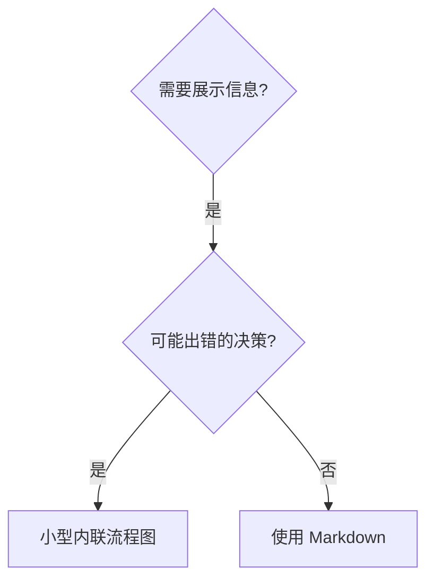
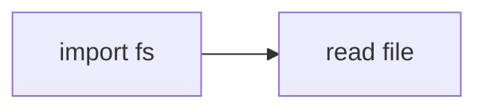

# 编写技能

## 概述

**编写技能是将测试驱动开发（TDD）应用于流程文档。**

**项目技能存放在 `.opencode/skills/` 中，任何共享库都应通过当前 OpenCode 环境指令暴露。**

你编写测试用例（使用子代理的压力场景），观察它们失败（基线行为），编写技能（文档），观察测试通过（代理合规），然后重构（关闭漏洞）。

**核心原则：**如果你没有观察过代理在没有技能的情况下失败，你就不知道这个技能是否教会了正确的东西。

**必需背景：**在使用此技能之前，你必须理解 `test-driven-development`。该技能定义了基本的 RED-GREEN-REFACTOR 循环。此技能将 TDD 适配到文档中。

**官方指南：**有关 Anthropic 的官方技能编写最佳实践，请参阅 anthropic-best-practices.md。本文档提供了额外的模式和指南，以补充此技能中以 TDD 为重点的方法。

## 什么是技能？

**技能**是针对已验证技术、模式或工具的参考指南。技能帮助未来的 OpenCode 会话找到并应用有效的方法。

**技能是：**可重用的技术、模式、工具、参考指南

**技能不是：**关于你如何一次性解决某个问题的叙述

## 技能的 TDD 映射

| TDD 概念 | 技能创建 |
|---------|---------|
| **测试用例** | 使用子代理的压力场景 |
| **生产代码** | 技能文档（SKILL.md） |
| **测试失败（RED）** | 代理在没有技能的情况下违反规则（基线） |
| **测试通过（GREEN）** | 代理在有技能时合规 |
| **重构** | 在保持合规的同时关闭漏洞 |
| **先写测试** | 在编写技能之前运行基线场景 |
| **观察失败** | 记录代理使用的准确辩解 |
| **最小化代码** | 编写解决这些特定违规的技能 |
| **观察通过** | 验证代理现在合规 |
| **重构循环** | 发现新的辩解 → 堵塞 → 重新验证 |

整个技能创建过程遵循 RED-GREEN-REFACTOR。

## 何时创建技能

**创建时机：**
- 技术对你来说不够直观明显
- 你会在多个项目中参考此内容
- 模式广泛适用（不是特定于项目的）
- 其他人会受益

**不要为以下情况创建：**
- 一次性解决方案
- 其他地方已有完善文档的标准实践
- 项目特定约定（放入 `AGENTS.md`）
- 机械约束（如果可以用正则/验证强制执行，就将其自动化——将文档留给需要判断的场景）

## 技能类型

### 技术
具有可遵循步骤的具体方法（condition-based-waiting、root-cause-tracing）

### 模式
思考问题的方式（flatten-with-flags、test-invariants）

### 参考
API 文档、语法指南、工具文档（office 文档）

## 目录结构


```
skills/
  skill-name/
    SKILL.md              # Main reference (required)
    supporting-file.*     # Only if needed
```

**扁平命名空间** - 所有技能都在一个可搜索的命名空间中

**单独文件用于：**
1. **大量参考**（100+ 行）- API 文档、综合语法
2. **可重用工具** - 脚本、工具、模板

**保持内联：**
- 原则和概念
- 代码模式（< 50 行）
- 其他所有内容

## SKILL.md 结构

**Frontmatter（YAML）：**
- 两个必填字段：`name` 和 `description`（有关所有支持的字段，请参阅 [agentskills.io/specification](https://agentskills.io/specification)）
- 总共最多 1024 个字符
- `name`：仅使用字母、数字和连字符（无括号、特殊字符）
- `description`：第三人称，仅描述何时使用（不是做什么的）
  - 以 "Use when..." 开头，聚焦于触发条件
  - 包含具体的症状、情况和上下文
  - **永远不要总结技能的过程或工作流**（原因见 OSO 部分）
  - 如果可能，保持在 500 个字符以内

```markdown
---
name: Skill-Name-With-Hyphens
description: Use when [specific triggering conditions and symptoms]
---

# Skill Name

## Overview
What is this? Core principle in 1-2 sentences.

## When to Use
[Small inline flowchart IF decision non-obvious]

Bullet list with SYMPTOMS and use cases
When NOT to use

## Core Pattern (for techniques/patterns)
Before/after code comparison

## Quick Reference
Table or bullets for scanning common operations

## Implementation
Inline code for simple patterns
Link to file for heavy reference or reusable tools

## Common Mistakes
What goes wrong + fixes

## Real-World Impact (optional)
Concrete results
```


## OpenCode 搜索优化（OSO）

**发现的关键：**未来的 OpenCode 会话需要找到你的技能

### 1. 丰富的描述字段

**目的：**OpenCode 读取描述元数据以决定为给定任务加载哪些技能。让它回答："我现在应该阅读这个技能吗？"

**格式：**以 "Use when..." 开头，聚焦于触发条件

**关键：描述 = 何时使用，不是技能做什么**

描述应该仅描述触发条件。不要在描述中总结技能的过程或工作流。

**为什么这很重要：**测试揭示，当描述总结技能的工作流时，代理可能会遵循描述而不是阅读完整的技能内容。一个说"任务之间的代码审查"的描述导致代理只做一次审查，尽管技能的流程图清楚地显示了两个审查（规范合规然后代码质量）。

当描述更改为只是 "Use when executing implementation plans with independent tasks"（无工作流总结）时，代理正确阅读了流程图并遵循了两阶段审查过程。

**陷阱：**总结工作流的描述会创建一个代理会采取的捷径。技能主体变成了它跳过的文档。

```yaml
# ❌ BAD: Summarizes workflow - the agent may follow this instead of reading skill
description: Use when executing plans - dispatches subagent per task with code review between tasks

# ❌ BAD: Too much process detail
description: Use for TDD - write test first, watch it fail, write minimal code, refactor

# ✅ GOOD: Just triggering conditions, no workflow summary
description: Use when executing implementation plans with independent tasks in the current session

# ✅ GOOD: Triggering conditions only
description: Use when implementing any feature or bugfix, before writing implementation code
```

**内容：**
- 使用具体的触发器、症状和情况来表明此技能适用
- 描述*问题*（竞态条件、不一致行为），而不是*语言特定的症状*（setTimeout、sleep）
- 保持触发器与技术无关，除非技能本身就是技术特定的
- 如果技能是技术特定的，在触发器中明确说明
- 用第三人称撰写（注入系统提示）
- **永远不要总结技能的过程或工作流**

```yaml
# ❌ BAD: Too abstract, vague, doesn't include when to use
description: For async testing

# ❌ BAD: First person
description: I can help you with async tests when they're flaky

# ❌ BAD: Mentions technology but skill isn't specific to it
description: Use when tests use setTimeout/sleep and are flaky

# ✅ GOOD: Starts with "Use when", describes problem, no workflow
description: Use when tests have race conditions, timing dependencies, or pass/fail inconsistently

# ✅ GOOD: Technology-specific skill with explicit trigger
description: Use when using React Router and handling authentication redirects
```

### 2. 关键词覆盖

使用 OpenCode 会搜索的词：
- 错误消息："Hook timed out"、"ENOTEMPTY"、"race condition"
- 症状："flaky"、"hanging"、"zombie"、"pollution"
- 同义词："timeout/hang/freeze"、"cleanup/teardown/afterEach"
- 工具：实际命令、库名称、文件类型

### 3. 描述性命名

**使用主动语态，动词优先：**
- ✅ `creating-skills` 而不是 `skill-creation`
- ✅ `condition-based-waiting` 而不是 `async-test-helpers`

### 4. Token 效率（关键）

**问题：**getting-started 和频繁引用的技能会加载到每个对话中。每个 token 都很重要。

**目标字数：**
- getting-started 工作流：每个 <150 词
- 频繁加载的技能：总计 <200 词
- 其他技能：<500 词（仍然要简洁）

**技巧：**

**将详细信息移至工具帮助：**
```bash
# ❌ BAD: Document all flags in SKILL.md
search-conversations supports --text, --both, --after DATE, --before DATE, --limit N

# ✅ GOOD: Reference --help
search-conversations supports multiple modes and filters. Run --help for details.
```

**使用交叉引用：**
```markdown
# ❌ BAD: Repeat workflow details
When searching, dispatch subagent with template...
[20 lines of repeated instructions]

# ✅ GOOD: Reference other skill
Always use subagents (50-100x context savings). REQUIRED: Use [other-skill-name] for workflow.
```

**压缩示例：**
```markdown
# ❌ BAD: Verbose example (42 words)
your human partner: "How did we handle authentication errors in React Router before?"
You: I'll search past conversations for React Router authentication patterns.
[Dispatch subagent with search query: "React Router authentication error handling 401"]

# ✅ GOOD: Minimal example (20 words)
Partner: "How did we handle auth errors in React Router?"
You: Searching...
[Dispatch subagent → synthesis]
```

**消除冗余：**
- 不要重复交叉引用技能中的内容
- 不要解释命令中显而易见的内容
- 不要包含同一模式的多个示例

**验证：**
```bash
wc -w skills/path/SKILL.md
# getting-started workflows: aim for <150 each
# Other frequently-loaded: aim for <200 total
```

**根据你做什么或核心洞察来命名：**
- ✅ `condition-based-waiting` > `async-test-helpers`
- ✅ `using-skills` 而不是 `skill-usage`
- ✅ `flatten-with-flags` > `data-structure-refactoring`
- ✅ `root-cause-tracing` > `debugging-techniques`

**动名词（-ing）适用于过程：**
- `creating-skills`、`testing-skills`、`debugging-with-logs`
- 主动，描述你正在采取的行动

### 4. 交叉引用其他技能

**编写引用其他技能的文档时：**

仅使用技能名称，并带有明确的要求标记：
- ✅ 好：`**REQUIRED SUB-SKILL:** Use test-driven-development`
- ✅ 好：`**REQUIRED BACKGROUND:** You MUST understand systematic-debugging`
- ❌ 坏：`See skills/testing/test-driven-development`（不清楚是否必需）
- ❌ 坏：`@skills/testing/test-driven-development/SKILL.md`（强制加载，消耗上下文）

**为什么不用 @ 链接：**`@` 语法会立即强制加载文件，在你需要它们之前消耗 200k+ 上下文。

## 流程图使用



**仅对以下内容使用流程图：**
- 不明显的决策点
- 你可能过早停止的过程循环
- "何时使用 A 而非 B" 的决策

**永远不要对以下内容使用流程图：**
- 参考材料 → 表格、列表
- 代码示例 → Markdown 代码块
- 线性指令 → 编号列表
- 没有语义意义的标签（step1、helper2）

**Mermaid 流程图规范：**
- 使用 `flowchart TD`（自上而下）或 `flowchart LR`（从左到右）
- 决策节点用 `{}`，处理节点用 `[]`，终态节点用 `(())`
- 带颜色的节点用 `style nodeId fill:颜色`
- 标签用 `-->|标签|` 语法

**为你的合作伙伴可视化：** Mermaid 图表可在 GitHub/GitLab 中直接渲染，也可使用 `mmdc` 命令行工具导出为 SVG：
```bash
mmdc -i input.mmd -o output.svg
```

## 代码示例

**一个优秀的示例胜过许多平庸的示例**

选择最相关的语言：
- 测试技术 → TypeScript/JavaScript
- 系统调试 → Shell/Python
- 数据处理 → Python

**好的示例：**
- 完整且可运行
- 注释良好，解释原因
- 来自真实场景
- 清晰展示模式
- 准备好适配（不是通用模板）

**不要：**
- 用 5 种以上语言实现
- 创建填空模板
- 编写人为构造的示例

你很擅长移植——一个优秀的示例就足够了。

## 文件组织

### 自包含技能
```
defense-in-depth/
  SKILL.md    # Everything inline
```
何时：所有内容都适合，不需要大量参考

### 带有可重用工具的技能
```
condition-based-waiting/
  SKILL.md    # Overview + patterns
  example.ts  # Working helpers to adapt
```
何时：工具是可重用代码，不仅仅是叙述

### 带有大量参考的技能
```
pptx/
  SKILL.md       # Overview + workflows
  pptxgenjs.md   # 600 lines API reference
  ooxml.md       # 500 lines XML structure
  scripts/       # Executable tools
```
何时：参考材料太大，无法内联

## 铁律（与 TDD 相同）

```
NO SKILL WITHOUT A FAILING TEST FIRST
```

这适用于新技能和现有技能的编辑。

在测试之前编写技能？删除它。重新开始。
未经测试就编辑技能？同样的违规。

**没有例外：**
- 不适用于"简单补充"
- 不适用于"只是添加一个章节"
- 不适用于"文档更新"
- 不要将未测试的更改保留为"参考"
- 不要在运行测试时"适配"
- 删除意味着删除

**必需背景：**`test-driven-development` 技能解释了为什么这很重要。相同的原则适用于文档。

## 测试所有技能类型

不同类型的技能需要不同的测试方法：

### 纪律执行型技能（规则/要求）

**示例：**TDD、verification-before-completion、designing-before-coding

**使用以下方式测试：**
- 学术问题：他们理解规则吗？
- 压力场景：他们在压力下合规吗？
- 多重压力组合：时间 + 沉没成本 + 疲惫
- 识别辩解并添加明确的反驳

**成功标准：**代理在最大压力下遵循规则

### 技术型技能（操作指南）

**示例：**condition-based-waiting、root-cause-tracing、defensive-programming

**使用以下方式测试：**
- 应用场景：他们能正确应用技术吗？
- 变化场景：他们处理边缘情况吗？
- 缺失信息测试：指令有缺口吗？

**成功标准：**代理成功将技术应用于新场景

### 模式型技能（心智模型）

**示例：**reducing-complexity、information-hiding 概念

**使用以下方式测试：**
- 识别场景：他们识别出模式何时适用吗？
- 应用场景：他们能使用心智模型吗？
- 反例：他们知道何时不适用吗？

**成功标准：**代理正确识别何时/如何应用模式

### 参考型技能（文档/API）

**示例：**API 文档、命令参考、库指南

**使用以下方式测试：**
- 检索场景：他们能找到正确的信息吗？
- 应用场景：他们能正确使用找到的内容吗？
- 缺口测试：常见用例被覆盖了吗？

**成功标准：**代理找到并正确应用参考信息

## 跳过测试的常见辩解

| 辩解 | 现实 |
|--------|---------|
| "Skill is obviously clear" | 对你清楚 ≠ 对其他代理清楚。测试它。 |
| "It's just a reference" | 参考可能有缺口、不清晰的章节。测试检索。 |
| "Testing is overkill" | 未测试的技能总是有问题。15 分钟测试节省数小时。 |
| "I'll test if problems emerge" | 问题 = 代理无法使用技能。在部署之前测试。 |
| "Too tedious to test" | 测试比在生产中调试坏技能不那么乏味。 |
| "I'm confident it's good" | 过度自信保证会有问题。还是要测试。 |
| "Academic review is enough" | 阅读 ≠ 使用。测试应用场景。 |
| "No time to test" | 部署未测试的技能会浪费更多时间以后修复。 |

**所有这些都意味着：部署之前测试。没有例外。**

## 防止技能的合理化漏洞

执行纪律的技能（如 TDD）需要抵抗合理化。代理很聪明，在压力下会找到漏洞。

**心理学注释：**理解为什么说服技巧有效有助于你系统地应用它们。请参阅 persuasion-principles.md 了解关于权威、承诺、稀缺、社会认同和团结原则的研究基础（Cialdini，2021；Meincke 等，2025）。

### 明确关闭每个漏洞

不要只陈述规则——禁止特定的变通方法：

<Bad>
```markdown
Write code before test? Delete it.
```
</Bad>

<Good>
```markdown
Write code before test? Delete it. Start over.

**No exceptions:**
- Don't keep it as "reference"
- Don't "adapt" it while writing tests
- Don't look at it
- Delete means delete
```
</Good>

### 处理"精神 vs 字面"的争论

尽早添加基础原则：

```markdown
**Violating the letter of the rules is violating the spirit of the rules.**
```

这切断了一整类"我遵循的是精神"的辩解。

### 建立辩解表

从基线测试中捕获辩解（见下面的测试部分）。代理提出的每个借口都放入表中：

```markdown
| Excuse | Reality |
|--------|---------|
| "Too simple to test" | Simple code breaks. Test takes 30 seconds. |
| "I'll test after" | Tests passing immediately prove nothing. |
| "Tests after achieve same goals" | Tests-after = "what does this do?" Tests-first = "what should this do?" |
```

### 创建红旗清单

让代理在合理化时容易自我检查：

```markdown
## Red Flags - STOP and Start Over

- Code before test
- "I already manually tested it"
- "Tests after achieve the same purpose"
- "It's about spirit not ritual"
- "This is different because..."

**All of these mean: Delete code. Start over with TDD.**
```

### 为违规症状更新 OSO

添加到描述：当你即将违反规则时的症状：

```yaml
description: use when implementing any feature or bugfix, before writing implementation code
```

## 技能的 RED-GREEN-REFACTOR

遵循 TDD 循环：

### RED：编写失败测试（基线）

在没有技能的情况下使用子代理运行压力场景。记录准确的行为：
- 他们做了什么选择？
- 他们使用了什么辩解（逐字记录）？
- 哪些压力触发了违规？

这就是"观察测试失败"——在编写技能之前，你必须看到代理自然会做什么。

### GREEN：编写最小化技能

编写解决这些特定辩解的技能。不要为假设情况添加额外内容。

在有技能的情况下运行相同场景。代理现在应该合规。

### REFACTOR：关闭漏洞

代理发现了新的辩解？添加明确的反驳。重新测试直到无懈可击。

**测试方法论：**请参阅 @testing-skills-with-subagents.md 了解完整的测试方法论：
- 如何编写压力场景
- 压力类型（时间、沉没成本、权威、疲惫）
- 系统地堵塞漏洞
- 元测试技术

## 反模式

### ❌ 叙述性示例
"In session 2025-10-03, we found empty projectDir caused..."
**为什么不好：**太具体，不可重用

### ❌ 多语言稀释
example-js.js, example-py.py, example-go.go
**为什么不好：**质量平庸，维护负担

### ❌ 流程图中的代码

**为什么不好：**无法复制粘贴，难以阅读

### ❌ 通用标签
helper1, helper2, step3, pattern4
**为什么不好：**标签应具有语义意义

## 停止：在继续下一个技能之前

**编写任何技能后，你必须停止并完成部署过程。**

**不要：**
- 批量创建多个技能而不测试每个技能
- 在当前技能验证之前继续下一个技能
- 因为"批量处理更高效"而跳过测试

**下面的部署清单对每个技能都是强制性的。**

部署未测试的技能 = 部署未测试的代码。这是违反质量标准的。

## 技能创建清单（TDD 适配）

**重要：使用 TodoWrite 为下面的每个清单项创建待办事项。**

**RED 阶段 - 编写失败测试：**
- [ ] 创建压力场景（纪律技能需要 3 个以上组合压力）
- [ ] 在没有技能的情况下运行场景 - 逐字记录基线行为
- [ ] 识别辩解/失败中的模式

**GREEN 阶段 - 编写最小化技能：**
- [ ] 名称仅使用字母、数字、连字符（无括号/特殊字符）
- [ ] YAML frontmatter 包含必需的 `name` 和 `description` 字段（最多 1024 个字符；请参阅 [spec](https://agentskills.io/specification)）
- [ ] 描述以 "Use when..." 开头并包含特定触发器/症状
- [ ] 描述用第三人称撰写
- [ ] 全文包含搜索关键词（错误、症状、工具）
- [ ] 清晰的概述与核心原则
- [ ] 解决 RED 中识别的特定基线失败
- [ ] 代码内联或链接到单独文件
- [ ] 一个优秀的示例（不是多语言）
- [ ] 在有技能的情况下运行场景 - 验证代理现在合规

**REFACTOR 阶段 - 关闭漏洞：**
- [ ] 从测试中识别新的辩解
- [ ] 添加明确的反驳（如果是纪律技能）
- [ ] 从所有测试迭代中建立辩解表
- [ ] 创建红旗清单
- [ ] 重新测试直到无懈可击

**质量检查：**
- [ ] 仅当决策不明显时使用小型流程图
- [ ] 快速参考表
- [ ] 常见错误部分
- [ ] 无叙述性故事
- [ ] 支持文件仅用于工具或大量参考

**部署：**
- [ ] 将技能提交到 git 并推送到你的 fork（如果已配置）
- [ ] 考虑通过 PR 回馈（如果广泛有用）

## 发现工作流

未来的 OpenCode 会话如何找到你的技能：

1. **遇到问题**（"tests are flaky"）
3. **找到技能**（描述匹配）
4. **扫描概述**（这相关吗？）
5. **阅读模式**（快速参考表）
6. **加载示例**（仅在实现时）

**为此流程优化** - 尽早并频繁地放置可搜索的术语。

## 总结

**创建技能就是流程文档的 TDD。**

相同的铁律：没有先失败的测试就没有技能。
相同的循环：RED（基线）→ GREEN（编写技能）→ REFACTOR（关闭漏洞）。
相同的好处：更好的质量、更少的意外、无懈可击的结果。

如果你遵循代码的 TDD，也请为技能遵循它。这是应用于文档的相同纪律。
